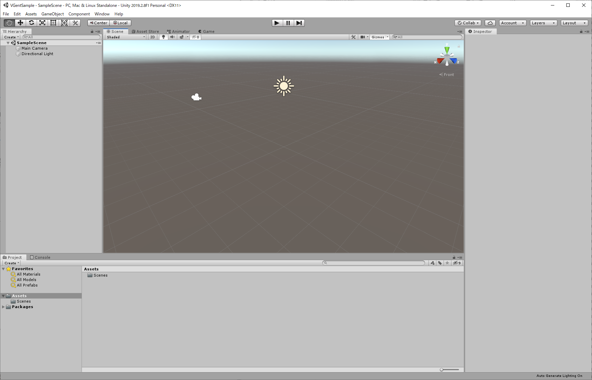
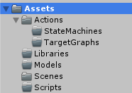

# Getting Started

## 入手

長谷川研究室のGitレポジトリ（注：アカウント作成が必要）から入手してください。

**※VGentは研究中のソフトウェアです。VGentのソースを外部に公開しないでください。**

- ライブラリ単体
  - http://git.haselab.net/haselab/SprUnity
  - 自前のUnityプロジェクトに組み込んで使う場合はこちらから入手してください。

- サンプルプロジェクト
  - http://git.haselab.net/haselab/VRMAgent 
  - Unityプロジェクト、サンプルシーン、ライブラリが全て含まれています。
  - 最新版を得るには **SimpleExample** ブランチにスイッチしてください。
  - SprUnityはgit submoduleの形で含まれているので、**submodule update** を行ってください。

## VGentの構造

## チュートリアル

**チュートリアルの進め方**

- ゼロから始める：　「[Unityの新規プロジェクトを作る](#Unityの新規プロジェクトを作る)」 から
- サンプルを元に試す
  - とりあえずサンプルを動かしたい：　「[動かしてみる](#動かしてみる)」
  - 新しい動作を作りたい：　「[Bodyを動かしてみる](#Bodyを動かしてみる)」から
  - キャラクタを変えたい：　「[キャラクタを追加する](#キャラクタを追加する)」から

#### Unityの新規プロジェクトを作る

#### フォルダを作る

Assetsにフォルダを追加して以下のようにします。なお、このフォルダ構成が動作上必須というわけではないので、慣れた流儀がある人はそれに従っても良いです。

- `Actions`：動作を定義するファイル（ステートマシンとターゲットグラフ）を置きます。
- `Libraries`：SprUnityやUniVRMなど、外部から取得した依存ライブラリを置きます。
- `Models`：キャラクタのモデルデータを置きます。
- `Scenes`：シーンファイルを置きます（このフォルダは最初からあります）。
- `Scripts`：このプロジェクト固有のスクリプトを置きます。

#### SprUnityを追加する

http://git.haselab.net/haselab/SprUnity の一式を`Libraries/SprUnity`フォルダに置きます。

置き場所は`Libraries`でなくてもかまいませんが、**フォルダ名は必ず`SprUnity`である必要があります（でないと動きません）**。また、あまりフォルダ階層の深いところには置かない方が良いです。

なお、SprUnityは、zipをダウンロードして展開したものを置いたり、git cloneしたものを置いたりしても構いませんが、プロジェクトをgitで管理しつつ最新のSprUnityを継続的に使えるようにしたいのであれば、**SprUnityをSubmoduleとして追加**すると良いでしょう。

#### UniVRMを追加する

 https://github.com/vrm-c/UniVRM/releases から最新のUniVRMパッケージをダウンロードしてインポートします。

インポートするとAssetsに`VRM`フォルダが追加されます。`Libraries`の下に移動しておくとAssetsのトップがすっきりします。

#### キャラクタを追加する

#### Bodyをセットアップする

#### Bodyを動かしてみる

#### ActionTargetGraphを作る

#### ActionStateMachineを作る

#### MentalSceneを作る

#### 簡単なキャラクタAIを書く

#### 動かしてみる