# Getting Started

## 入手

長谷川研究室のGitレポジトリ（注：アカウント作成が必要）から入手してください。

**※VGentは研究中のソフトウェアです。VGentのソースを外部に公開しないでください。**

- ライブラリ単体
  - http://git.haselab.net/haselab/SprUnity.git
  - 自前のUnityプロジェクトに組み込んで使う場合はこちらから入手してください。

- サンプルプロジェクト
  - http://git.haselab.net/haselab/VGentSample.git
  - Unityプロジェクト、サンプルシーン、ライブラリが全て含まれています。
  - SprUnityはgit submoduleの形で含まれているので、cloneした後に**submodule update** を行ってください。

## VGentの構造

T.B.W.

## チュートリアル

**チュートリアルの進め方**

- ゼロから始める：　「[Unityの新規プロジェクトを作る](#Unityの新規プロジェクトを作る)」 から
- サンプルを元に試す
  - とりあえずサンプルを動かしたい：　「[動かしてみる](#動かしてみる)」
  - 新しい動作を作りたい：　「[Bodyを動かしてみる](#Bodyを動かしてみる)」から
  - キャラクタを変えたい：　「[キャラクタを追加する](#キャラクタを追加する)」から

#### Unityの新規プロジェクトを作る

#### フォルダを作る

Assetsにフォルダを追加して以下のようにします。なお、このフォルダ構成が動作上必須というわけではないので、慣れた流儀がある人はそれに従っても良いです。

- `Actions`：動作を定義するファイル（ステートマシンとターゲットグラフ）を置きます。
- `Libraries`：SprUnityやUniVRMなど、外部から取得した依存ライブラリを置きます。
- `Models`：キャラクタのモデルデータを置きます。
- `Scenes`：シーンファイルを置きます（このフォルダは最初からあります）。
- `Scripts`：このプロジェクト固有のスクリプトを置きます。

#### SprUnityを追加する

http://git.haselab.net/haselab/SprUnity から**ActionEditorブランチ**を取得して、一式を`Libraries/SprUnity`フォルダに置きます。

置き場所は`Libraries`でなくてもかまいませんが、**フォルダ名は必ず`SprUnity`である必要があります（でないと動きません）**。また、あまりフォルダ階層の深いところには置かない方が良いです。

なお、SprUnityは、zipをダウンロードして展開したものを置いたり、git cloneしたものを置いたりしても構いませんが、プロジェクトをgitで管理しつつ最新のSprUnityを継続的に使えるようにしたいのであれば、**SprUnityをSubmoduleとして追加**すると良いでしょう（ActionEditorブランチにswitchするのを忘れずに）。

#### UniVRMを追加する

 https://github.com/vrm-c/UniVRM/releases から最新のUniVRMパッケージ（UniVRM-0.XX.X_XXXX.unitypackage）をダウンロードしてインポートします。

インポートするとAssetsに`VRM`フォルダが追加されます。`Libraries`の下に移動しておくとAssetsのトップがすっきりします。

#### キャラクタを追加する

好きなキャラクタのVRMファイルを用意します。[VRoid Studio]( https://vroid.com/studio )で作成してエクスポートしたり、[VRoid Hub]( https://hub.vroid.com/ )から権利的に問題のないモデルをダウンロードしてきても良いでしょう（もちろん他にも沢山の方法があります）。

VRMファイルをAssetsフォルダにドラッグアンドドロップすると、モデルデータが自動でインポートされます（しばらく時間がかかります）。

インポートが完了すると以下のようなファイルができています（この例ではViVi.vrmをロードしました）。

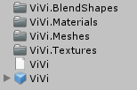

`Models/モデル名`というフォルダを作ってその中に移動しておきます。

`Models/モデル名/モデル名`というプレハブ（青い四角アイコン）をシーンにドラッグアンドドロップするとキャラクタがロードされます。

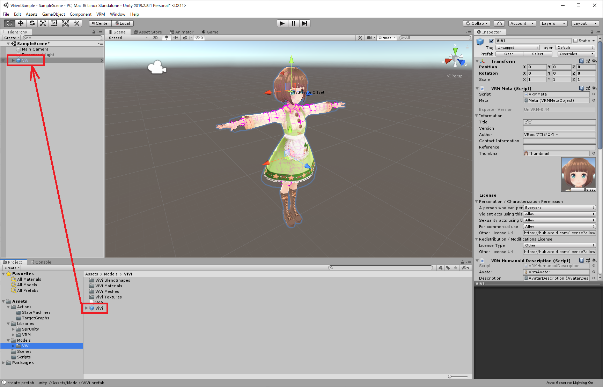

#### Bodyをセットアップする

新しいオブジェクトをCreate Emptyで作成して、キャラクタモデルをその下に移動しておきます（必須ではありませんが、シーンを整理して見やすくするためです）。以下ではCharacterという名前にしました。

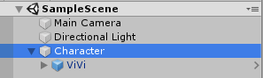

このCharacterの下に、キャラクタの身体物理モデルや、アクションの管理をするオブジェクトを追加していきます。

`Assets/Libraries/SprUnity/VGent/Prefabs`にある`BodyPhysicalModel`というプレハブを、Characterにドラッグアンドドロップして実体化させます。

|                                                          |                                                          |
| -------------------------------------------------------- | -------------------------------------------------------- |
| 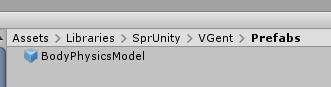 | 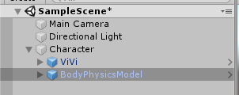 |

プレハブのままだと次の作業ができないので、Unpack Prefabしておきます。シーン内のBodyPhysicsModelのアイコンが灰色の四角に変わればOKです。

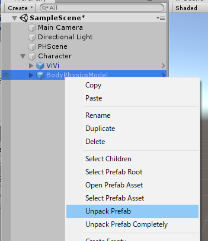

次に、BodyPhysicalModelを選択して、Bodyコンポーネントの「Avatar Animator」の項目にキャラクタモデルのAnimatorをセットします。キャラクタモデルを Avatar Animator の上にドラッグアンドドロップするとセットできます。

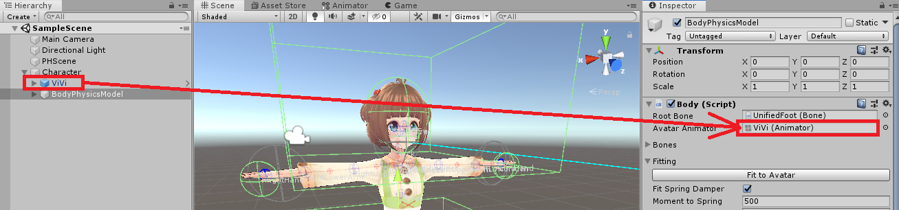

続けて、Bodyコンポーネントの「Fit to Avatar」ボタンを押します。Spring/Damper等が上書きされる旨の警告がでますがここでは気にせず「Fit」を選んでください。

これでキャラクタモデルと身体物理モデルが連結されます（身体モデルのサイズが合っていない場合もこの時に合うように調整されます）。

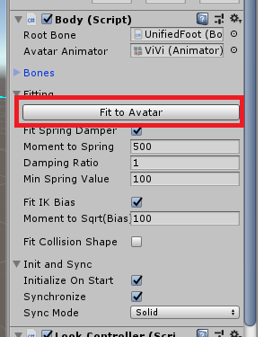

最後に、Springhead物理エンジンを管理する`PHScene`オブジェクトを作ります。適当な場所に新しいオブジェクトをCreate Emptyします。ここではPHSceneという名前にしました。

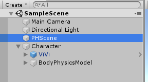

作成したPHSceneオブジェクトに、PHSceneBehaviourというコンポーネントをアタッチします。

| Before                                                   | After                                                    |
| -------------------------------------------------------- | -------------------------------------------------------- |
| 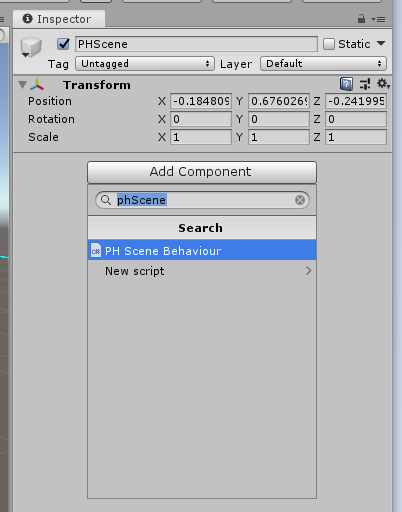 | 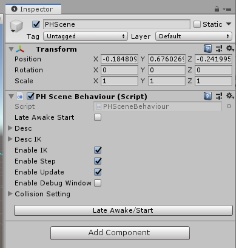 |

続いてPHSceneBehaviourの設定をします。

- Desc > Num Iteration を 30 に
- Desc IK > Regularize Param を 0.25 に
- Collision SettingでAdd Collision Rule を押し、以下のように設定（現在のモデルでは衝突があるとうまく動かないため、物理エンジンのの衝突判定をオフにしています）
  - Target Solid 1：All
  - Target Solid 2：All
  - Contact Mode： MODE_NONE

以下のようになればOKです。

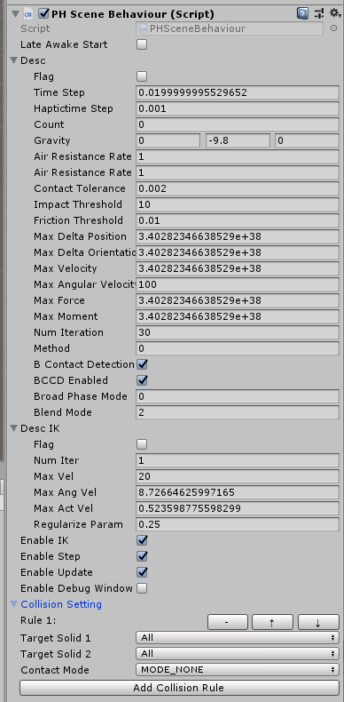

#### Bodyを動かしてみる

ここまでできたら、Unityを実行モードにするとシミュレーションが動作し、キャラクタが少し動くはずです。

以降の作業は**GameビューではなくSceneビュー**上で行います。

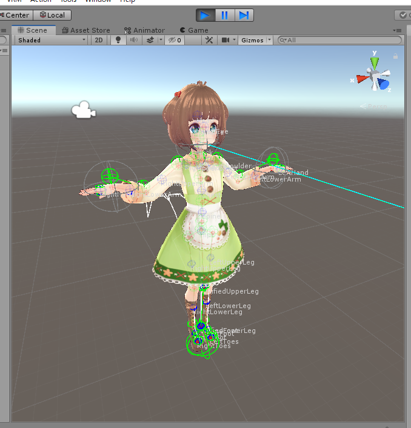

試しに手を動かしてみます。BodyPhysicalModelの中にLeftHandというオブジェクトがあるので選択し、インスペクタのBone Controllerという項目を開いてください。

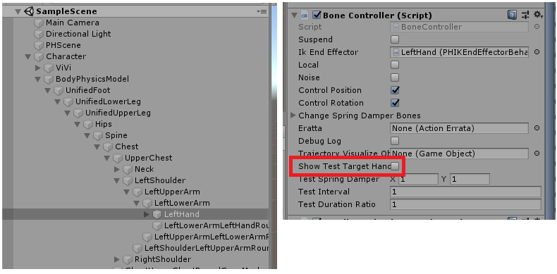

Show Test Target Handleというチェックボックスを有効にすると、左手の目標位置・姿勢を指定するためのハンドルが出現します。

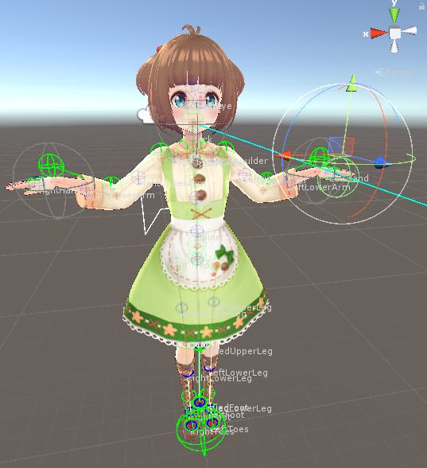

ハンドルを移動させたり回転させたりすると、左手をその位置・姿勢に持って行こうとキャラクタが動くはずです。

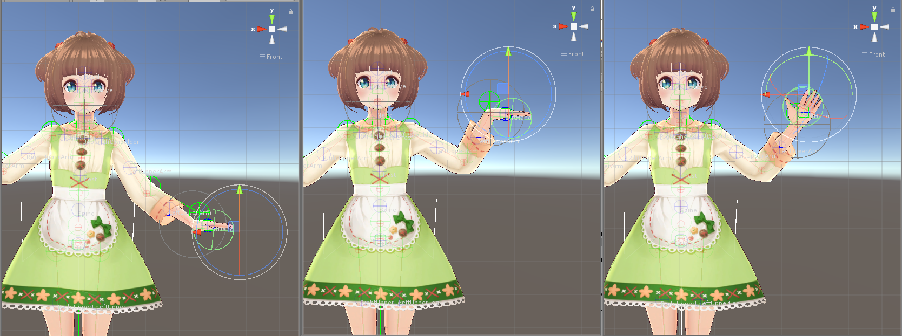

ハンドルをマウスであちこちに動かしても、キャラクタが手を動かすのは1秒に1回であることに気がつくかもしれません。これは Bone Controller の Test Interval が 1 (秒) に設定されているためです。Test Intervalを0.1秒にしてみたり、逆に2秒にしてみたりして、ハンドルをマウスで動かしたときに手の付いてくる様子が変わることを確かめてみてください。

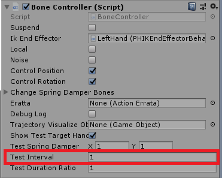

次に、Test Intervalを1に戻し、Test Duration Ratioを 0.5 や 2 に変えて動きを確かめてみましょう。

- 0.5 : 素早く動いては止まる、を繰り返す
- 2 : 滑らかで曲線的な動きでハンドルを追いかけ続け、ハンドルが止まるとハンドルの場所で止まる

といった動作が見られるはずです。

この挙動について、少し詳しく解説します。Show Test Target HandleがONになっている間、Bone Controllerは手先をその時点でのハンドルの位置・姿勢に向けて動かそうとする「到達動作」を、Test Interval秒ごとに実行します。この１回の到達動作を、VGentでは**「サブムーブメント(Sub movement)」**と呼びます。

サブムーブメントには目標時間があります。例えば目標時間が1秒であれば、1秒で目標位置・姿勢に向かうように動きます。Test Duration Ratioは、**目標時間をTest Intervalの何倍にするか**を設定します。

- Test Duration Ratioが0.5のとき、1回1回のサブムーブメントは、サブムーブメントが実行される間隔の半分の時間で終わりますので、動いては止まる、を繰り返すことになります。
- Test Duration Ratioが2の時は、「前のサブムーブメントが終わる前に次の（新しいハンドル位置に向けて到達しようとするような）サブムーブメントが開始される」ことになります。このような時、VGentは**実行中のサブムーブメントを重ね合わせた動き**を生成します。これは、前の目標に到達しようとする途中で新たな目標に方向転換したような、**滑らかな曲線**になります。これは**本当の人間の到達動作でも行われている**ことです。このように目標時間をうまく設定しサブムーブメントの重ね合わせを活用することで、滑らかで連続した動作を得ることができます。

最後に、Test Spring Damperの値も変えてみましょう。XがSpring、YがDamperの値です（PD制御流に言えばSpringはP係数、DamperはD係数に相当します）。

- Springが大きいほど力強く、小さいほど弱い力で動きます。小さくしすぎると手を重力に対抗して持ち上げることもできなくなるでしょう。
- DamperはSpringによる振動を抑える働きを持ちます。Damperを1より小さくすると振り子やバネのような「揺れ」や「振動」が多く発生するようになります。逆にDamperを大きくすると振動はなくなっていきますが、大きくしすぎると動作自体が遅くなります。

VGentでは、後に述べる仕組みを使って身体のSpring/Damperの値を時々刻々変化させて動作させることができます。いくつに設定すべきかは動作の性質によって異なるので、VGentで動作をデザインする際には目標位置・タイミングだけでなくその時点でのSpring/Damperをいくつにするかを設定することも重要です。

例えば「手を振って下ろす」動作を例にとると

- 手を持ち上げる
  - 持ち上げられるだけの力が必要なので Springを大きく、Damperも併せて大きく
- 手を左右に振る
  - 素早く振る力が必要なのでSpringを大きく、揺れは発生して良いのでDamperは相対的に小さめに
- 手を下ろす
  - 下ろした状態で脱力するのでSpringを弱く、揺れは多少発生して良いが揺れすぎても困るのでDamperは小さすぎない値に

のようにSpring/Damperの値を段階ごとに変化させることが考えられます。

##### 注

Show Test Target HandleやTest Intervalは、Testとあるとおり動作確認用の機能です。**実際にインタラクティブキャラクタを動作させる際にこれらの機能を用いることはない**ので注意してください。また、左手以外にも、Bone Controllerがアタッチされた身体部位ならどこでも同じように試しに動かしてみることができます。

また、**以降の作業をはじめる前に「Show Test Target Handle」はオフに戻しておいてください。**

#### ActionManagerを作る

ここからは具体的にインタラクティブキャラクタのための動作データの作り方に入りますが、それに先だってAction Managerを作っておく必要があります。Action Managerは、VGentで動作を実行するための総元締めになるコンポーネントです。

Characterの下に新しいオブジェクトをCreate Emptyし、そのオブジェクトに Action Manager というコンポーネントをアタッチします。

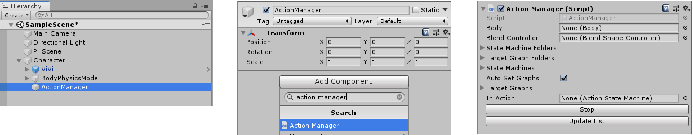

Action Managerには、動作に使うステートマシンやターゲットグラフといったデータを格納するフォルダをあらかじめ決めて設定しておく必要があります。以下のように設定してください（Sizeに「1」を入力してからFolderボタンを押すとフォルダ選択ウィンドウが開きます）。

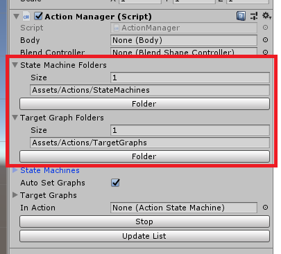

#### ActionTargetGraphを作る

Actions/TargetGraphsフォルダで右クリックメニューを出し、Create > VGent Action > Action Target Graph を押してください。

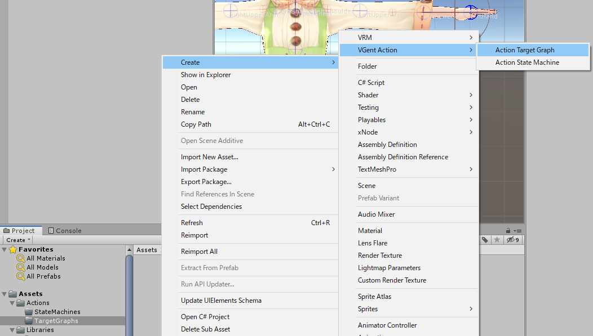

フォルダ内にNew Action Target Graphという名前のアセットができ、以下のような「xNode」というタイトルのウィンドウが新たに開きます。（注：かなり時間がかかるかもしれませんが仕様です。）

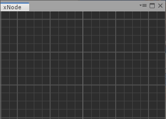

この**xNodeと書かれたウィンドウは偽物なので何もせずに閉じてください。**今作成されたNew Action Target Graphをダブルクリックします。

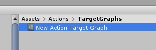

すると、先ほどと同じような、ただし**Action Target Graph**と書かれたウィンドウが開きます。これがAction Target Graphを編集するためのウィンドウ（本物）です。

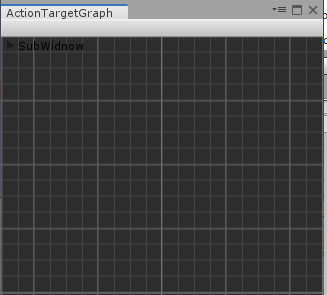

Action Target Graphを使って手を動かしてみます。

まず基準座標系をとります。ここではキャラクタの身体を中心とする座標系を基準とすることにします。Action Target Graphウィンドウ内で右クリックメニューを出し、Coordinate > Body を選択します。すると「Body Coordinate」と書かれた**ノード**が作成されます。

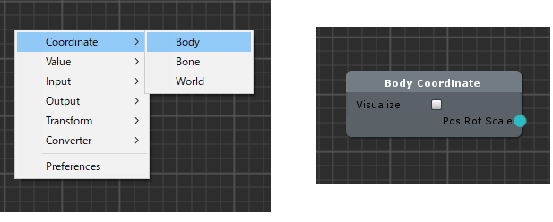

同様に、今度は Transform > Relative と操作します。これは、**入力された座標系を基準として、所定の相対位置・相対姿勢となるような新たな座標系を出力する**という機能を持ったノードです。

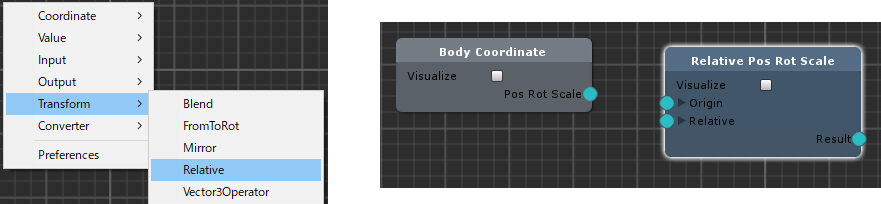

Body CoordinateノードのPos Rot Scaleと、Relative Pos Rot ScaleノードのOriginをマウスドラッグで接続します。これは「キャラクタの身体の位置と向きを基準とした、所定の相対位置と姿勢」を意味します。

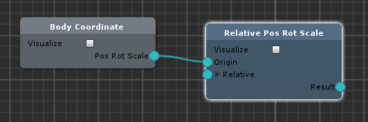

さらに、Output > BoneKeypose と操作して Action Target Outputノードを追加します。これは、受け取った座標系を手や足や頭など身体部位の目標位置姿勢とするノードです。

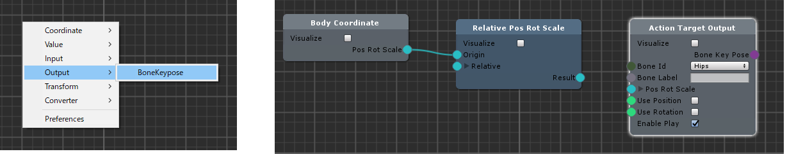

RelativeのResultとOutputのPos Rot Scaleを接続し、Bone IdをLeft Handに変え、Use Position / Use Rotationの両方にチェックを入れます。これで**「キャラクタの身体に対して所定の相対位置・姿勢に向けて左手を到達させる」**という動作目標を構築したことになります。

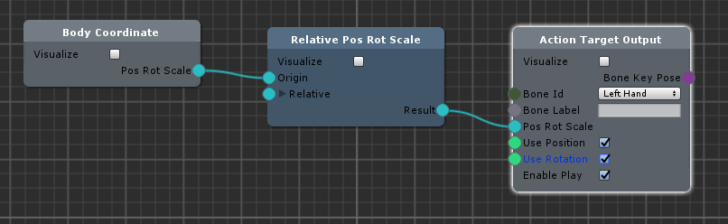

Action Target Graphとは、このように**「基準となる座標系を、変換ノードで次々と変換していき、最終出力を手や足や頭などの目標姿勢とする」**ことで、自分や相手の位置姿勢に応じた動作目標をリアルタイムで生成するための仕組みです。

ここまで「所定の相対姿勢」と書きましたが、その具体的な位置・姿勢を設定するには、Relative Pos Rot Scaleノードの「Visualize」にチェックを入れます。すると、Sceneビュー内に相対位置姿勢をセットするためのハンドルが現れます。ハンドルを動かすと、Relative Pos Rot Scaleノード内の「Position」「Rotation」の値が連動して変化することが分かると思います。

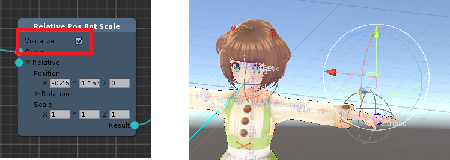

ただし、これだけではどんな手の目標位置・姿勢なのか分かりづらいかもしれません。OutputノードのVisualizeにもチェックを入れると、どんな目標姿勢なのかを3Dモデルで表示してくれます（ただし、Bone Idが手・足・頭の場合に限ります）。

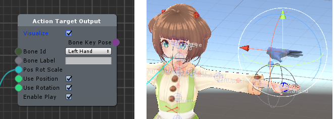

左手をスカートの横に持って行くような目標位置姿勢をセットしてみました。

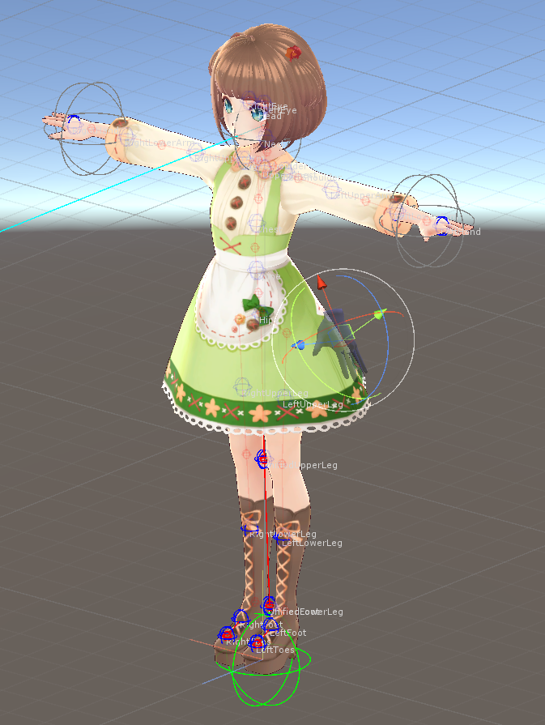

試しに動かしてみましょう。Unityを実行モードにし、ActionTargetGraphウィンドウの左上にある小さな黒い三角をクリックすると「SubWindow」と書かれたパネルが出現します。

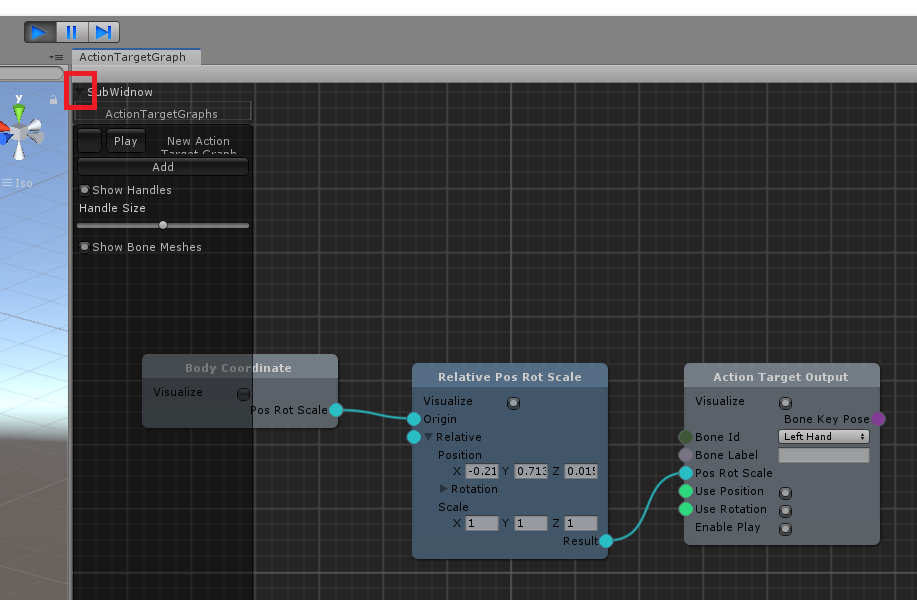

ここには作成済みのAction Target Graphの一覧が出てきます。New Action Target Graphの項目の横にある「Play」を押してみてください。

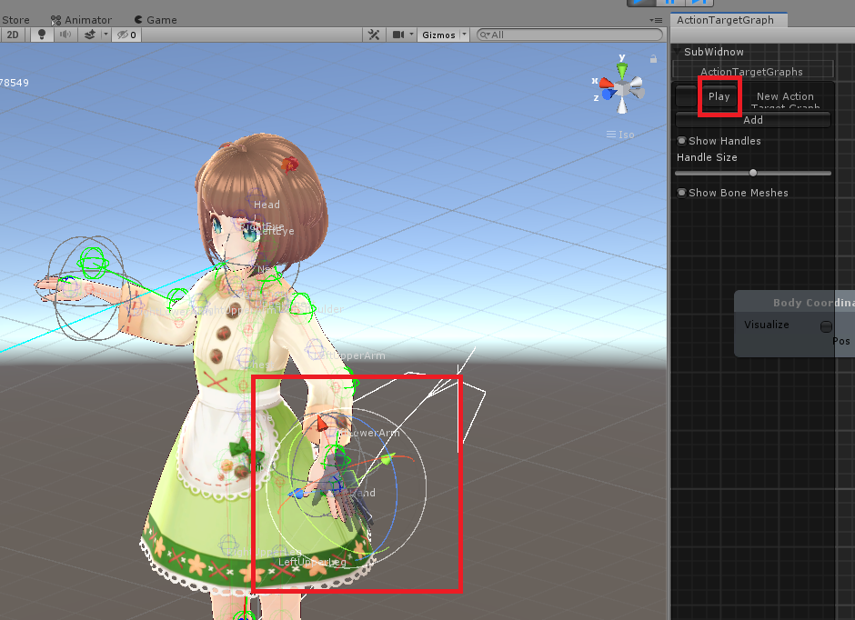

左手がこのように動作すれば成功です。

**注：作成したはずのActionTargetGraphがSubWindowの一覧に出てこない場合は、ActionTargetGraphウィンドウのタブを右クリックして「Reload List」をクリックしてみてください。**

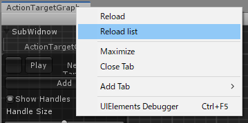

同様にして右手の目標位置も設定します。まずOutput > BoneKeyPoseノードを追加して、対象を右手に設定します。

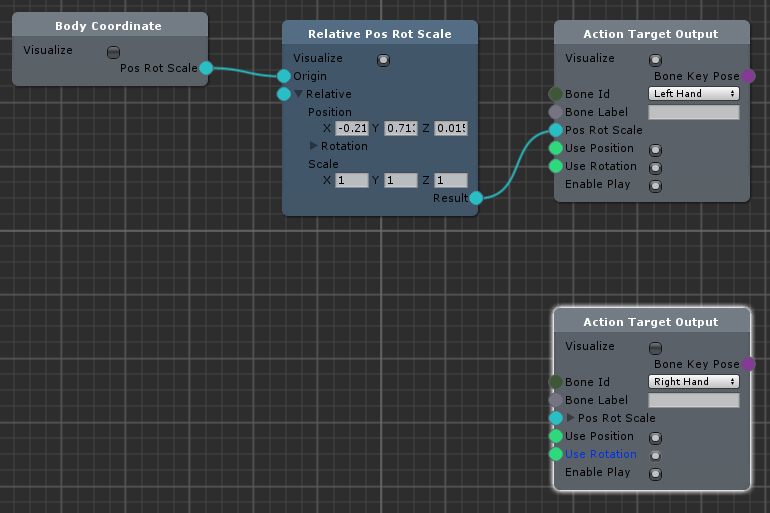

右手の位置を指定するためにRelative Pos Rot Scaleノードをもう一つ追加しても良いのですが、ここでは右手と左手の目標が左右対称であることを利用して、左手の目標を鏡像反転させて使うことにします。

Transform > Mirrorノードを選択し、Relative→Mirror→Output(右手) と接続します。目標位置・姿勢のどちらとも鏡像反転したいので、Mirror PositionおよびMirror Rotationにチェックを入れます。

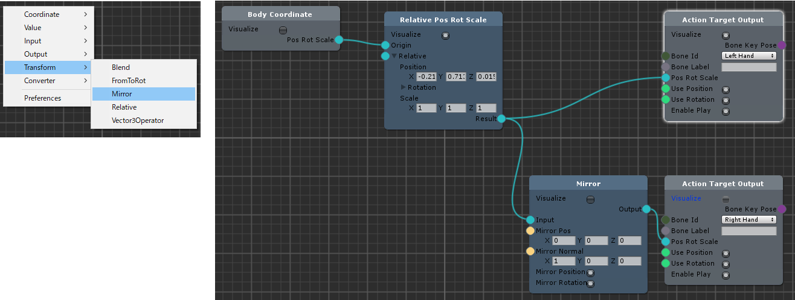

この状態で右手のOutputノードもVisualizeすると、右手の位置にも左右反転した目標位置姿勢が出力されていることが分かります。

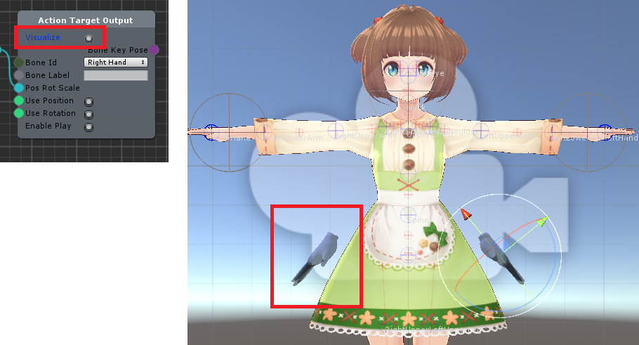

ちなみにMirrorノードのMirror Posは鏡像反転における鏡の位置、Mirror Normalは鏡の向きを示す法線です。初期状態では原点を中心にY-Z平面に対して反転するような設定になっています。

Unityを実行モードにし、先ほど同様にPlayを押して両手とも動作すれば成功です。

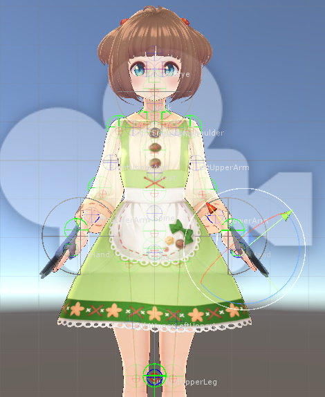

少し違う例を紹介します。これは Input > Perception Object を入力ノードに用いた例です。これは、与えられたオブジェクト（Perception Object）の位置に向けて手を到達させようとする、という動作を実現する最もシンプルな例です。

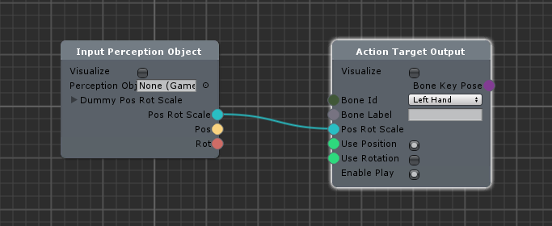

「到達対象となるオブジェクト」は、例えばキャラクタと触れ合おうとしているユーザーの手や頭であったり、キャラクタが手に取ろうとしているバーチャルな物体であったり、様々なものが考えられます。実際のインタラクティブキャラクタでは、キャラクタAIが動作を実行するときに対象オブジェクトを指定して動作を実行することになります（「"この物体" に向けて "手を伸ばす" 動作をしろ」とか「"この人" に向けて "手を振る" 動作をしろ」といった感じです）。

もっとも、Action Target Graphを作成している時点ではキャラクタAIはまだ作成されていないことも多いので、キャラクタAIがなくても動作を試すための機能がついています。Input Perception ObjectのVisualizeをOnにすると「試しにここに到達対象があると仮定して動かしてみる」ためのハンドルが表示されます。このハンドルを移動した後で先ほどまでと同様に動作の「Play」を押すと、このハンドルを仮の動作対象として、動作が実行されます。

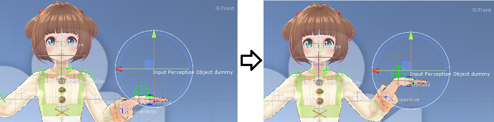

**注：Sceneビューでハンドルを移動させた後、ActionTargetGraphウィンドウにマウスカーソルを戻さないとDummy Pos Rot Scaleに値が反映されない場合があるようです。**

以上のように、Action Target Graphでは、

- 自分の身体を基準とする「Body Coordinate」や、到達対象となるオブジェクトの位置姿勢を表す「Input Perception Object」を起点として、
- さまざまな変換や補間をつなぎあわせ、
- 最終的に相手の位置によって適切に変化する所望の「目標位置」を出力し、身体部位の目標位置姿勢とする

ことになります。多様な動作を記述できるようにするため様々なノードが用意されており、今後も追加される予定です。

現時点でAction Target Graphで使えるノードの一覧と機能（大雑把ですが）を以下に示します。

- Coordinate：基準座標系を出力するノード
  - Body：キャラクタ自身の身体を基準とする座標系
  - Bone：キャラクタを構成する特定の身体部位の位置姿勢を基準とする座標系
  - World：ワールド座標系
- Value：特定の値を出力するノード。これらの値はGUIで固定値を設定するだけでなく、キャラクタAIが実行時に値をセットするという使い方もできる
  - Float：特定のfloat値
  - Int：特定のint値
  - PosRotScale：特定の位置（Vector3）・姿勢（Quaternion）・スケール（Vector3）の組
  - Quaternion：特定のクォータニオン値
  - Vector3：特定の3次元ベクトル値
- Input：シーンからの入力
  - PerceptionObject：シーン中の特定の物体の位置姿勢を出力するノード
- Output：身体部位への目標位置姿勢出力
  - BoneKeyPose：入力された位置姿勢を、指定した身体部位の目標に設定するノード
- Transform：変換ノード
  - Blend：二つのPosRotScaleの間を指定した割合で補間して出力するノード
  - FromToRot：ある方向ベクトルを別の方向ベクトルに一致させるための回転（Quaternion）を出力するノード
  - Mirror：入力された位置姿勢を鏡像反転した位置姿勢を出力するノード
  - Relative：入力された位置姿勢を基準として、それに対し所定の相対位置姿勢を出力するノード
  - Vector3Operator：ベクトルの演算。入力ベクトル同士の和・差・内積・外積を出力するノード
- Converter：値の種類を変換するノード
  - DecomposePose：Poseを位置(Vector3)と姿勢(Quaternion)に分解するノード
  - DecomposePosRotScale：PosRotScaleを位置・姿勢・スケールに分解するノード
  - DecomposeVector3：Vector3をx, y, zそれぞれの値（float値）に分解するノード

ちなみに、「相手の位置に向かって右手を振る」という動作のためのAction Target Graphは次のようになります（この例では右手を振る動作は右手を左・右・左・右…と２種類の目標位置に対して交互に移動することで行わせているため、右手に対する出力ノードが2つあります）。

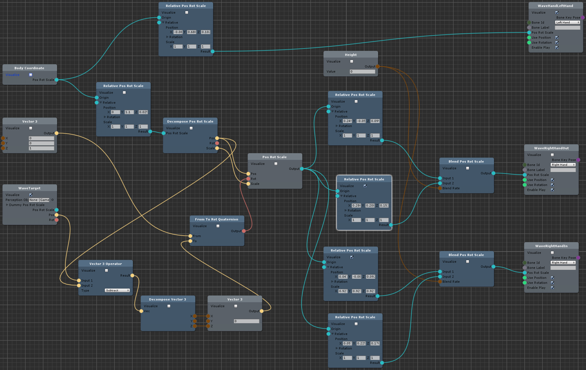

#### ActionStateMachineを作る

Action Target Graphは「１種類の目標位置・姿勢」を記述するものです。一方で、実際にキャラクタに動作をさせるときは、複数種類の目標を順次切り替えながら動作をすることになります。

時間経過や条件判断に従って目標位置を順次切り替えていくためには、Action State Machineを使います。

Actions/StateMachinesフォルダの中で右クリックメニューから Create > VGent Action > Action State Machine を選択すると、新しいAction State Machineが作成できます。

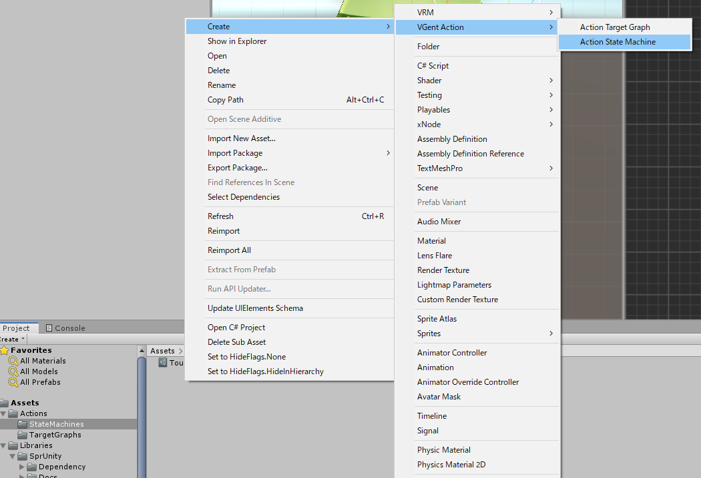

作成されたファイルをダブルクリックするとAction State Machineを編集するウィンドウが開きます。

Action State Machineはステートマシン（有限状態オートマトンとも言う）です。作成直後は、Entryステート（開始状態）とExitステート（終了状態）だけがある状態です。

Action State Machineウィンドウの何もないところで右クリックすると、ステートを追加するメニューが出ます。また、ステート上で右クリックするとステート間に遷移を追加するメニューが出ます。

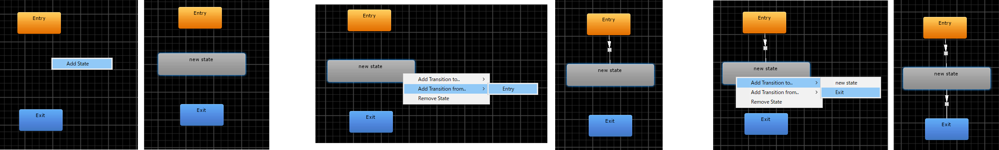

作成したステートを選択（左クリック）すると、インスペクタにそのステートに関する設定事項が出ます。

「Nodes」の項目には、Action Target GraphのOutput Nodeを設定することができます。例えばSizeを2に設定してから、先ほど作成したAction Traget GraphのOutputノードオブジェクトをドラッグアンドドロップして登録します。

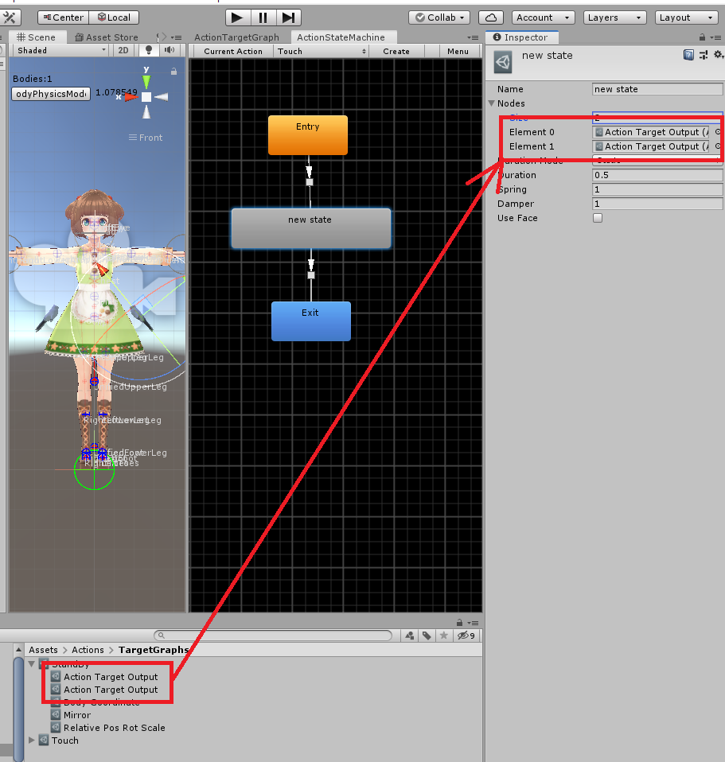

これで、**このステートに入ったとき、Nodesに登録したOutputノードの動作が行われる**ことになります。

- Duration
- Spring
- Damper

は、この動作にかける時間や、動作時のSpring Damper値を設定する項目です。

作成したAction State Machineを実行してみます。

ActionManagerオブジェクトを選択し、インスペクタの「Update List」を押します。すると、作成したステートマシンがState Machinesのリストに追加され、動作を実行するためのボタンが表示されます。（下の例ではステートマシン作成ののち「Touch」という名前に変更しているのでそのように表示されています。）

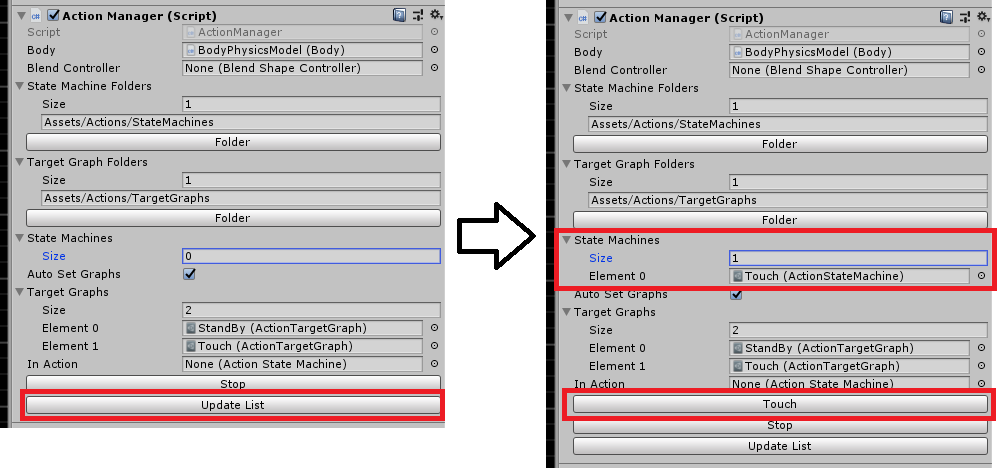

Unityを実行モードにして、作成したステートマシン名が表示されているボタン（上の例では「Touch」ボタン）を押すと、動作が実行されます。

次はもう少し複雑な例です。ステートを３つ追加し、それぞれのステートのNameを変更してから（右クリックメニューで遷移先を選ぶ際に、名前が同じだと一つしか表示されないため）、状態の遷移を作成します。

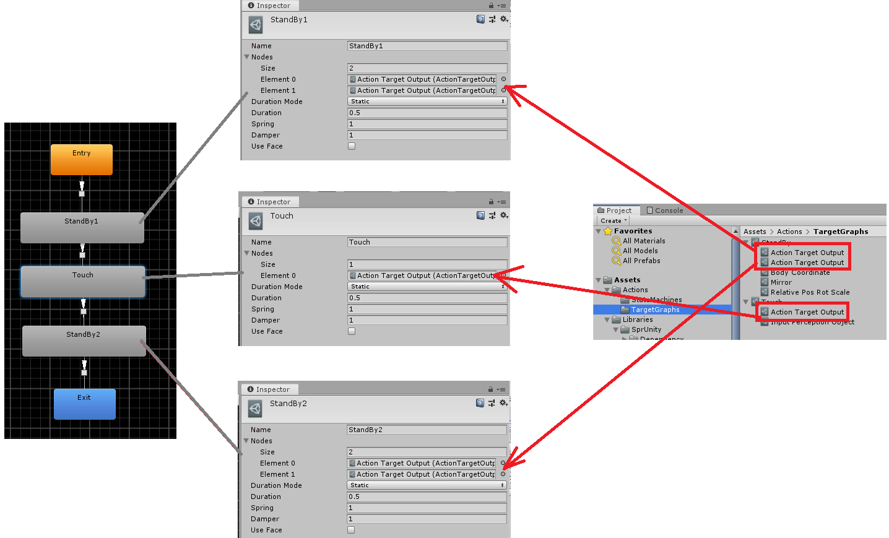

こうすると、動作を開始してから

- 最初はStandByターゲットグラフの左手・右手の動作（手をスカートの横に）
- その次にTouchターゲットグラフの左手の動作（手をターゲットに）
- 最後に再びStandByターゲットグラフの左手・右手の動作（手をスカートの横に戻す）

という一連の動作を行うことになります。

上記のステートマシンでは、StandBy開始 →(1秒)→ Touch開始 →(1秒)→ StandBy開始 というタイミングで動作が実行されます。状態間の遷移がどれも1秒で行われるためです。

遷移を示すの矢印の中央にある白い四角をクリックすると、インスペクタに遷移に関する情報が表示されます。

「Time」の項目が遷移までの時間です。初期状態ではInterval Modeが「Static Time From Previous Sub Movement Start (動作開始から一定秒数)」となっているので、StandBy1の到達動作が開始してから1秒でTouch状態に遷移します。この数字を変更すると、動作のタイミングを変えることができます。

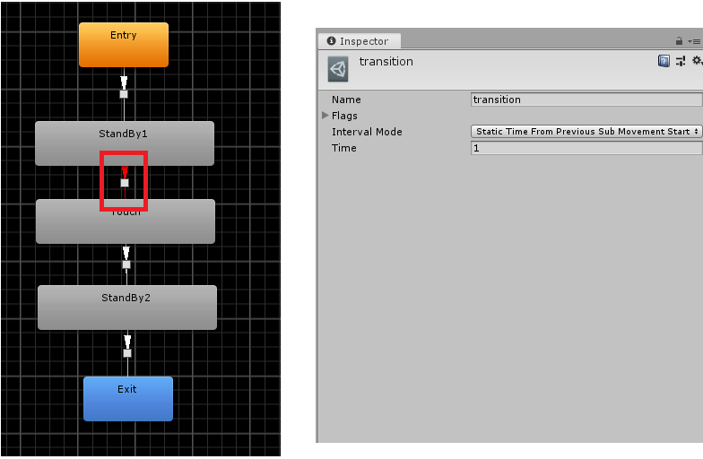

ちなみにInterval Modeはデフォルトの「動作開始から一定秒数」のほかにも、「動作終了から一定秒数」「動作の長さに比例した秒数」「ランダム」など何種類かあります。

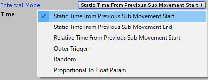

#### MentalSceneを作る

T.B.W.

#### 簡単なキャラクタAIを書く

T.B.W.

#### 動かしてみる

T.B.W.