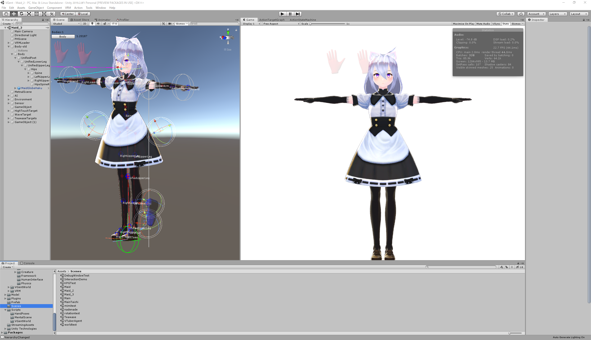
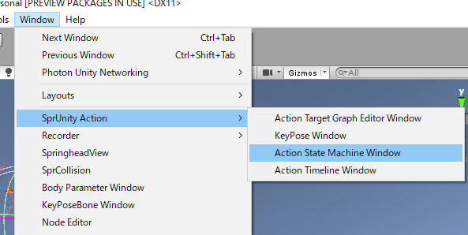
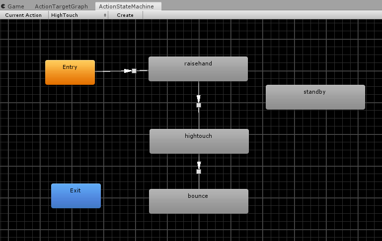
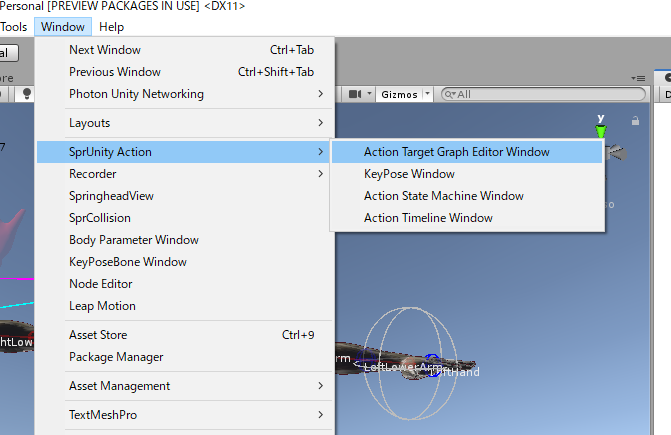
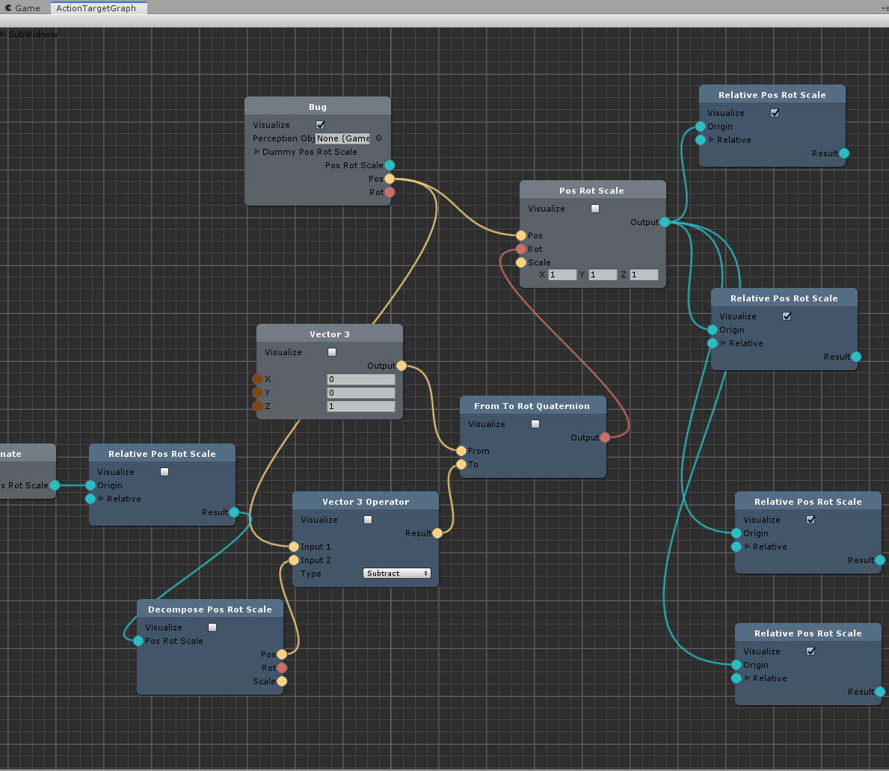
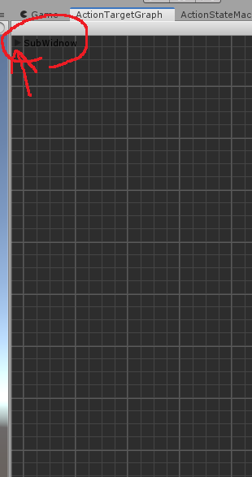
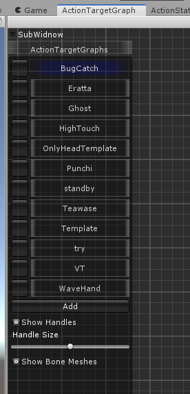

# Getting Started

## サンプルとその動かし方

### 入手

サンプルは　http://git.haselab.net/haselab/VRMAgent　にあります。

- git.haselab.netのアカウントが必要なので作成してください。
- 2019年10月時点では、 **Unity 2019.2.8f1** に対応しています。

SprUnityはSubmoduleとして組み込まれているので、Git cloneののちSubmodule Updateしてください。

### シーンを開く

`Assets/Scenes/Maid_2`を開きます。

キーを押すと動作するはず…ですが、完全にはうまく動かないかもしれません。
- T：手合わせ動作
- Y：手を振る
- H：ハイタッチ
- C：虫取り

詳しくは`Scripts/VGentTestAI.cs`のUpdate()関数を読んでみてください。

### 定義されている動作の内容を見てみる

#### ActionStateMachine

|表示のしかた||
| -------------------------------------------------------- | -------------------------------------------------------- |
|  |  |

#### ActionTargetGraph

|表示のしかた||
| -------------------------------------------------------- | -------------------------------------------------------- |
|  |  |

左上の三角（非常に見づらいですが）をクリックすると、ActionTargetGraphの一覧が出ます。

|||
| -------------------------------------------------------- | -------------------------------------------------------- | ---- |
|  |  |      |

